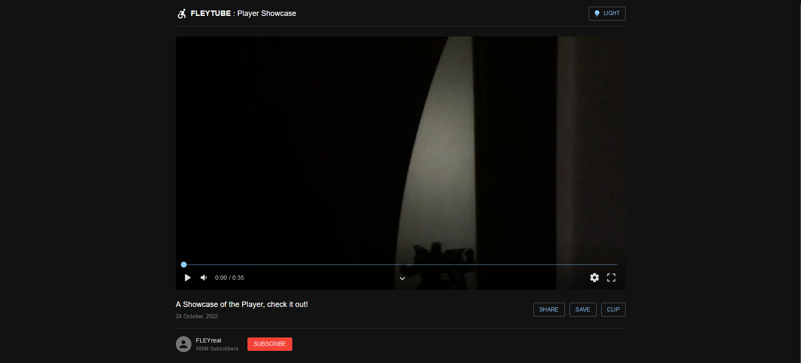

# Video-Player
Made with ReactJS and Material-UI.



### Features
- Play / Pause
- Volume
- Fullscreen
- Mini-mode
- Hints
- Settings menu
- Loop
- Custom Speed
- Timeline / Video Length
- Hide / Show menu
- Keybinds for all operations

### Usage
```tsx

<VideoPlayer
  src={video} // Source of the video
  sx={{ width: '100%' }} // SX is Advanced Styling from MUI
  keyHandler={{keyHandler}} // Key handler is a handler that allows to apply custom keys to player.
/>

```
